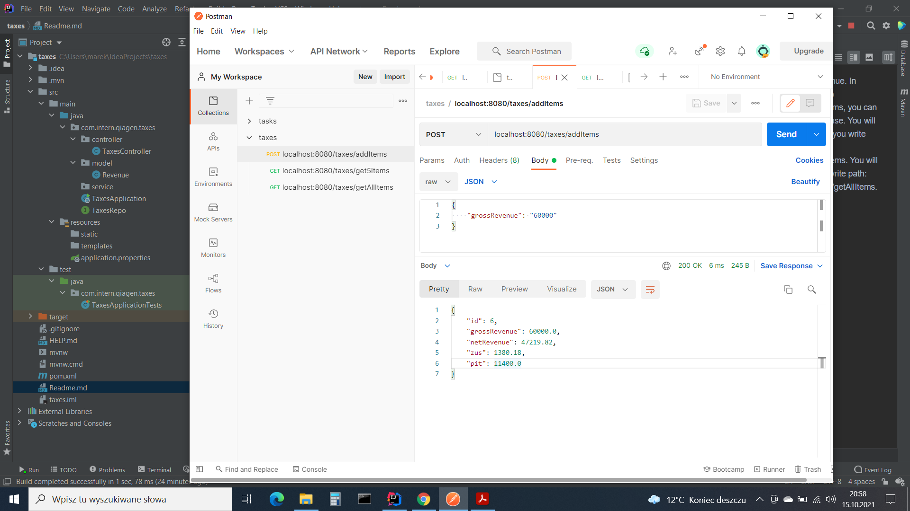

Application counts net revenue. In postman write path: 
(POST) localhost:8080/taxes/addItems, if you can add and count. 
Next send in JASON grossRevenue value.
You will keep last five values, when you write path: (GET)  localhost:8080/taxes/get5Items.
You will keep all values, when you write path: (GET)  localhost:8080/taxes/getAllItems.

